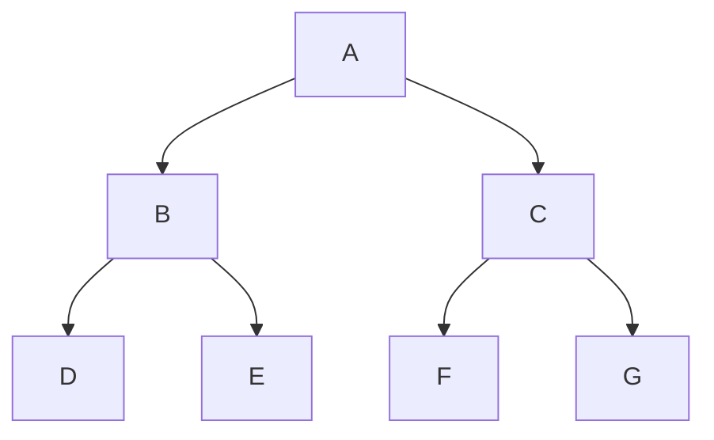

# O que é BFS?

BFS significa Breadth-First Search, que traduz para algo como "Busca Priorizando Largura". Nessa busca, todos os nós da árvore são visitados nível a nível, partindo da raiz até o nível mais profundo. É um conceito muito mais simples de entender, o desafio sendo de fato a implementação uma vez que a lógica está entendida. Não há um padrão amplamente reconhecido que categorize as formas de se fazer a BFS, mas comumente os nós de cada nível são lidos da esquerda pra direita.

Seja a seguinte árvore:

A trajetória BFS seria dada por: A B C D E F G.

## A lógica de uma BFS

A lógica da BFS gira em torno de dar prioridade aos elementos que estão mais próximos do nível 0, isto é, o nível da raiz. Os elementos que ficarem mais abaixo precisarão esperar mais antes de serem lidos. Quem estiver mais perto da raiz espera menos e quem estiver mais longe espera mais... é como uma fila, não? Uma fila na qual chega primeiro quem estiver mais perto da raiz e chega por último quem estiver mais distante, e quem chega primeiro terá o nó lido primeiro. E essa estrutura de dados de fato existe, e o melhor de tudo é que não precisamos implementá-la do zero pois já é uma estrutura padrão da STL do C++.

Usemos a seguinte notação:
- lchild -> filho à esquerda
- rchild -> filho à direita

Portanto funcionará assim: toda vez que pegarmos um nó ele será lido, se ele tiver lchild colocaremos ele na fila, e depois se tiver um rchild ele será colocado na fila também. Por fim, abrimos mão do nó atual e pegamos o nó que está na primeira posição da fila e repetimos todo esse processo com ele. O ciclo acaba quando a fila estiver vazia.