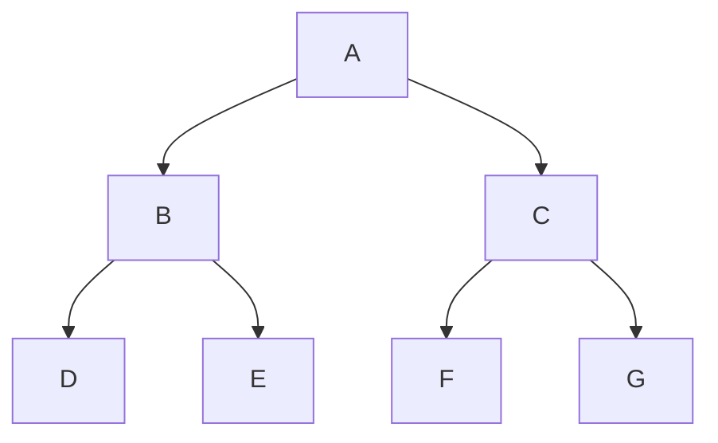

# O que é DFS?

DFS é o acrônimo correspondente para Depth-First Search, que traduz para algo como "Busca Priorizando Profundidade", que de fato explica bem o que essa busca performa: partindo da raiz, ela faz o caminho de maior profundidade até alguma folha e depois volta para explorar os outros nós.

Existem diferentes tipos de algoritmos DFS, mas que por vezes se diferem bem pouco entre si apesar dos diferentes resultados. Imagine o seguinte conjunto de operações:

L: mover para o nó da esquerda.

D: ler o valor do nó.

R: mover para o nó da direita.

É possível montar ordem de prioridade para essas operações de três formas diferentes: LDR, DLR, LRD, RDL, DRL e RLD.

As três primeiras formas são as mais conhecidas e recebem os seguintes nomes:

- Inorder / Infixa (LDR)
- Preorder / Prefixa (DLR)
- Postorder / Pósfixa (LRD)

Esses conceitos são mais fáceis de absorver com exemplos. Seja a seguinte árvore:

Temos os seguintes resultados retornados de cada percurso:

- Inorder: DBEAFCG
- Preorder: ABDECFG
- Postorder: DEBFGCA