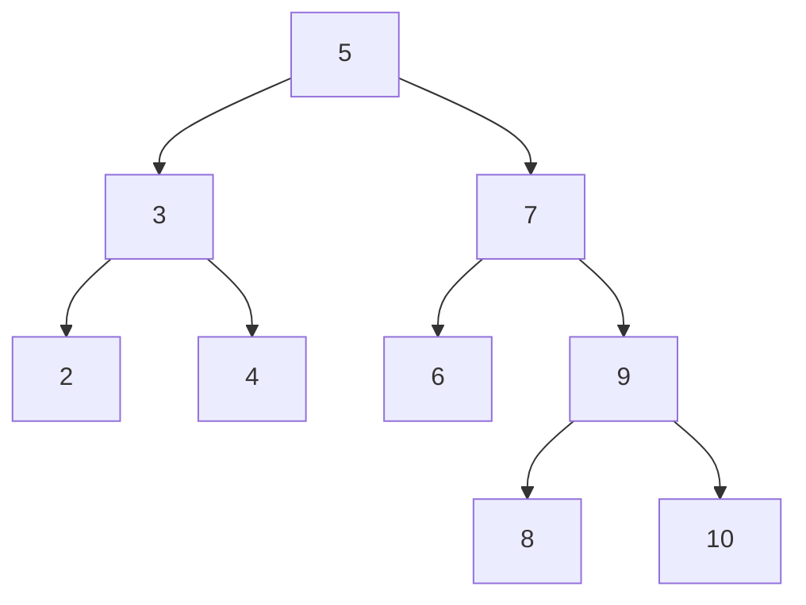

# DFS Iterativa

A DFS iterativa é uma forma muito eficiente porém mais complicada de se fazer a DFS de uma árvore binária. Então se é a primeira DFS que você está olhando, **veja a DFS recursiva primeiro**.

## Como fazer DFS iterativa?

A princípio soa muito difícil fazer uma DFS sem recursão, e de fato é complicado chegar a uma resposta por si só. Mas o fator chave que ajuda a criar as DFSs iterativas são outras estruturas de dados, nesse caso a pilha. Felizmente a pilha já é uma estrutura de dados padrão do C++ então não vamos precisar nos preocupar em implementá-la do zero.

Nada melhor para entender do que exemplos, então vamos a um exemplo com um passo a passo bem detalhado. A seguinte árvore será usada de exemplo para todos as explicações a seguir:

### Inorder

Pegamos a raiz da árvore como referencial inicial. No inorder, a folha mais a esquerda da árvore precisa ser lida primeiro, mas é preciso chegar até lá guardando referências para podermos ler os outros valores depois também. Então antes de mover para a esquerda, deixaremos a referência ao nó do qual estamos saindo na pilha:

Passo 1:

Nó atual = 5 : Pilha = {} : inorder {}

Passo 2:

Nó atual = 3 : Pilha {5} : inorder {}

Passo 3:

Nó atual = 2 : Pilha {3, 5} : inorder {}

Passo 4:

Nó atual = nullptr : Pilha {2, 3, 5} : inorder {}

>Chegamos ao caso em que algo diferente deve ser feito, já que encontramos uma referência nula de ponteiro. Agora, o que deve ser feito é pegar o valor que está no topo da pilha e lê-lo, bem como procurar por um filho à direita desse nó em seguida.

Passo 5:

Nó atual = 2 : Pilha {3, 5} : inorder {2}

Passo 6:

Nó atual = nullptr : Pilha {3, 5} : inorder {2}

>Mais uma vez encontramos um ponteiro nulo, pois o nó de valor 2 não possuía nem filho à esquerda nem filho a direita. Isso quer dizer que toda a subárvore esquerda do nó de valor 3 já foi explorada, então é hora de explorar a subárvore direita dele. Mais uma vez é chamado o nó do topo da pilha e adicionamo-os ao resultado, e olhamos seu filho à direita então:

Passo 7:

Nó atual = 3 : Pilha {5} : inorder {2, 3}

Passo 8:

Nó atual = 4 : Pilha {5} : inorder {2, 3}

Passo 9:

Nó atual = nullptr : Pilha {4, 5} : inorder {2, 3}

Passo 10:

Nó atual = 4 : Pilha {5} : inorder {2, 3, 4}

Passo 11:

Nó atual = nullptr : Pilha {5} : inorder {2, 3, 4}

>Toda a subárvore à esquerda da raiz foi explorada, agora o mesmo processo se repete para o outro lado!

**Nesse ponto já está claro como funciona o processo de gerar uma inorder iterativa.**

Agora que a linha de raciocínio para DFSs está um pouco mais clara, tente aplicar isso para as DFSs preorder e postorder.

