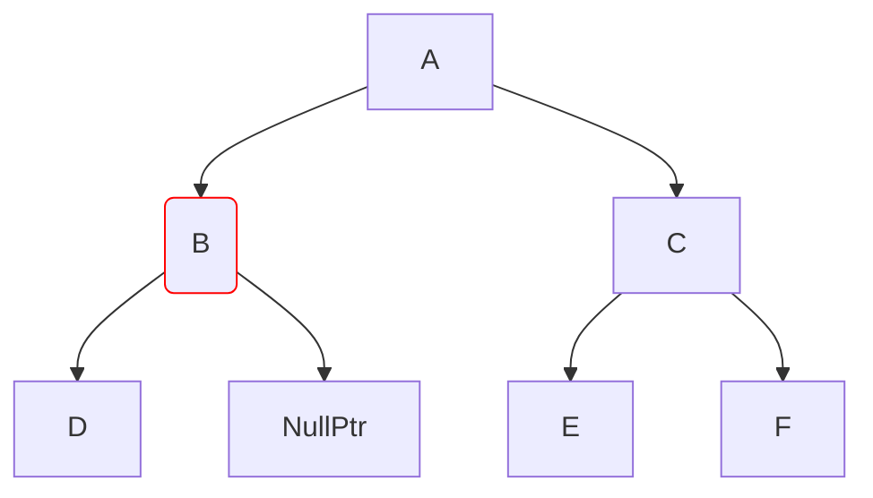
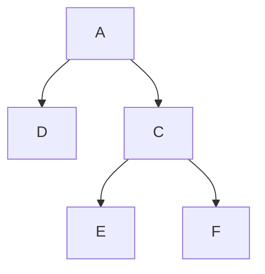
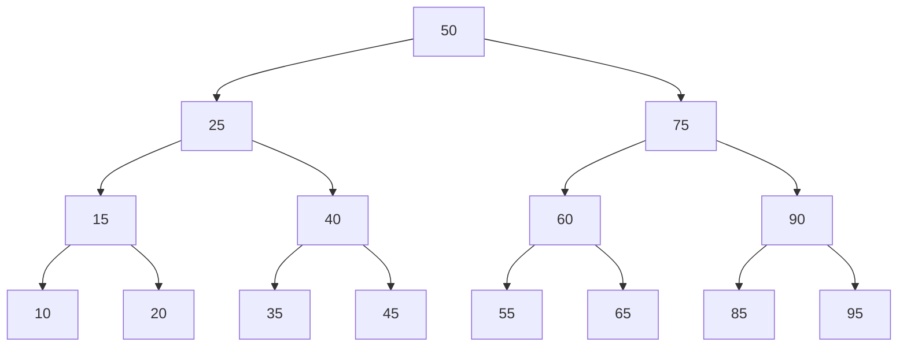

# Removendo nós de uma BST

Para remover nós de uma BST, sempre existirão 3 casos possíveis, os quais serão tratados de formas diferentes.

## O nó a se remover não tem nenhum filho

Nesse caso, estamos removendo uma folha da árvore, portanto não é necessário se preocupar com o que acontece com os filhos desse nó já que ele não tem filhos. Basta remover o nó.

## O nó a se remover tem apenas um filho

Agora as coisas devem ser tratadas com mais cautela. Façamos uma analogia com a vida real, se removermos um "galho" da árvore, todas suas folhas vão junto. Nesse caso, precisamos encontrar uma maneira de remover apenas esse nó em específico da árvore sem perder referência dos que vem depois dele.

Para fazer isso, nesse caso ainda é simples, pois basta substituir o nó removido pelo seu único filho. Veja:

Vamos remover o nó B em destaque.

## O nó a se remover tem dois filhos

Mas e se o nó a se remover tiver dois filhos? Na abordagem anterior nós substituir o nó pai removido pelo seu único nó filho, mas e agora, podemos escolher um dos filhos para substituí-lo de forma arbitrária?

Note que, ao tentar substituir um pai de dois filhos por um de seus filhos, ele se tornaria um nó com três filhos (os dois que já tinha e seu antigo irmão) e isso viola as propriedades naturais de uma árvore binária, portanto isso não é possível.

