# Árvores RB

Árvores Red-Black ou rubro-negras são um subtipo de árvores binárias que utilizam de uma propriedade adicional e um conjunto de regras ao redor dessa propriedade para gerenciar o balanceamento dessa árvore. Primeiramente, é necessário entender o que é balanceamento.

## Balanceamento

Balanceamento em árvores binárias diz respeito a regular a estrutura da árvore binária de modo a garantir que ela nunca esteja desbalanceada, e com desbalanceada entende-se árvores que “tiram pouco proveito de seus níveis”, tendo poucos nós por nível. Árvores RB garantem que uma árvore tenham uma altura de no máximo 2log_2(n + 1).

O balanceamento sempre é realizado, se necessário, após a inserção de um novo nó na árvore. Agora é um bom momento para prosseguirmos para como são feitas as operações nas árvores RB.

## Pesquisa

Como o padrão de valores menores à esquerda e valores maiores à direita é herdado do padrão das árvores binárias de busca, a pesquisa não difere do que foi visto anteriormente.

## Inserção

A inserção, a princípio, é feita da mesma forma também, até chegar a etapa de balanceamento. Ao finalmente ser inserido, algumas propriedades devem ser conferidas.

Vamos tomar o seguinte formato como exemplo:

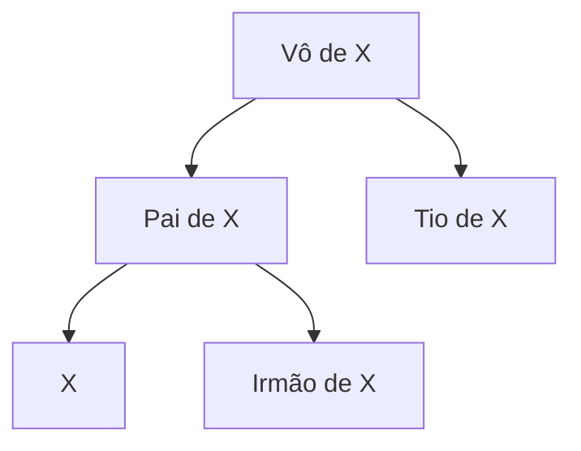

- Se o nó inserido X for a raiz, então troque sua cor para PRETO, do contrário mantenha VERMELHO e prossiga
- Se o Pai de X for VERMELHO, cheque a cor do Tio de X
    - Se o Tio de X for VERMELHO, inverta as cores do Pai de X, do Tio de X e do Vô de X. A cor do Vô de X não deve ser trocada se esse for a raiz.
    - Se o Tio de X for PRETO, performe a rotação de acordo com a posição de X

## Rotações

Existem 4 casos possíveis de rotação:

### Caso LL

O caso LL é um caso simples.

```mermaid
graph TD

A("Vô de X")
B("Pai de X")
C("Tio de X")
D("X")

A --> B
A --> C
B --> D
B --> T3
D --> T1
D --> T2
C --> T4
C --> T5

style D fill:#f00
style B fill:#f00
style A fill:#000
style C fill:#000
```

> A sub-árvore à direita do Pai de X passa a ser a sub-árvore a direita do Vô de X, enquanto o Vô de X passa a ser o seu filho da direita. As cores do Pai de X e do Vô de X são invertidas.

```mermaid
graph TD

A("Vô de X")
B("Pai de X")
C("Tio de X")
D("X")

B --> D
B --> A
D --> T1
D --> T2
A --> T3
A --> C
C --> T4
C --> T5

style D fill:#f00
style B fill:#000
style A fill:#f00
style C fill:#000
```

### Caso LR

O caso LR é um caso razoavelmente mais complicado.

```mermaid
graph TD

A("Vô de X")
B("Pai de X")
C("Tio de X")
T1("T1")
D("X")

A --> B
A --> C
B --> T1
B --> D
D --> T2
D --> T3
C --> T4
C --> T5

style D fill:#f00
style B fill:#f00
style A fill:#000
style C fill:#000
```
> Primeiramente, a subárvore esquerda de X passa a ser a subárvore direita do Pai de X, enquanto o Pai de X se torna o filho à esquerda de X, e X se torna filho de seu Vô.

```mermaid
graph TD

A("Vô de X")
B("Pai de X")
C("Tio de X")
T1("T1")
D("X")

A --> D
A --> C
B --> T1
B --> T2
D --> B
D --> T3
C --> T4
C --> T5

style D fill:#f00
style B fill:#f00
style A fill:#000
style C fill:#000
```

> Agora se repete o processo realizado no caso LL, exceto pelo fato de que agora o Pai de X e o X "trocaram de lugar".

```mermaid
graph TD

D("X")
A("Pai de X")
T1("T1")
T2("T2")
B("Vô de X")
T3("T3")
C("Tio de X")


A --> T1
A --> T2
D --> B
D --> A
B --> T3
B --> C
C --> T4
C --> T5


style D fill:#000
style B fill:#f00
style A fill:#F00
style C fill:#000
```

### Caso RL

O caso RL é outro caso razoavelmente complicado, parecido com o caso LR mas espelhado.

```mermaid
graph TD

A("Vô de X")
B("Pai de X")
C("Tio de X")
D("X")
T1("T1")
T2("T2")
T3("T3")
T4("T4")
T5("T5")

A --> C
A --> B
C --> T1
C --> T2
B --> D
B --> T5
D --> T3
D --> T4

style A fill:#000
style B fill:#f00
style C fill:#000
style D fill:#f00

```

```mermaid
graph TD

A("Vô de X")
B("Pai de X")
C("Tio de X")
D("X")
T1("T1")
T2("T2")
T3("T3")
T4("T4")
T5("T5")

A --> C
A --> D
C --> T1
C --> T2
D --> T3
D --> B
B --> T4
B --> T5

style A fill:#000
style B fill:#f00
style C fill:#000
style D fill:#f00

```

```mermaid
graph TD

A("Vô de X")
B("Pai de X")
C("Tio de X")
D("X")
T1("T1")
T2("T2")
T3("T3")
T4("T4")
T5("T5")

D --> A
D --> B
A --> C
A --> T3
C --> T1
C --> T2
B --> T4
B --> T5

style A fill:#f00
style B fill:#f00
style C fill:#000
style D fill:#000
```

### Caso RR

Por fim, o caso RR é tão simples quanto o LL.

```mermaid
graph TD

A("Vô de X")
B("Pai de X")
C("Tio de X")
D("X")
T1("T1")
T2("T2")
T3("T3")
T4("T4")
T5("T5")

A --> C
A --> B
C --> T1
C --> T2
B --> T3
B --> D
D --> T4
D --> T5

style A fill:#000
style B fill:#f00
style C fill:#000
style D fill:#f00

```

```mermaid
graph TD

A("Vô de X")
B("Pai de X")
C("Tio de X")
D("X")
T1("T1")
T2("T2")
T3("T3")
T4("T4")
T5("T5")

B --> A
B --> D
A --> C
A --> T3
C --> T1
C --> T2
D --> T4
D --> T5

style A fill:#f00
style B fill:#000
style C fill:#000
style D fill:#f00
```
